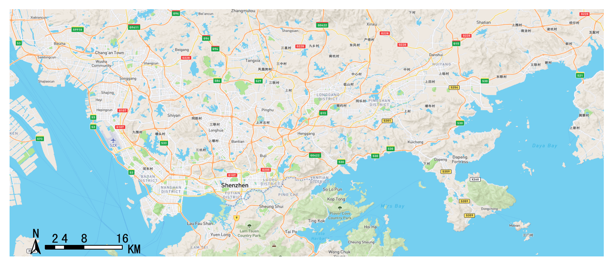
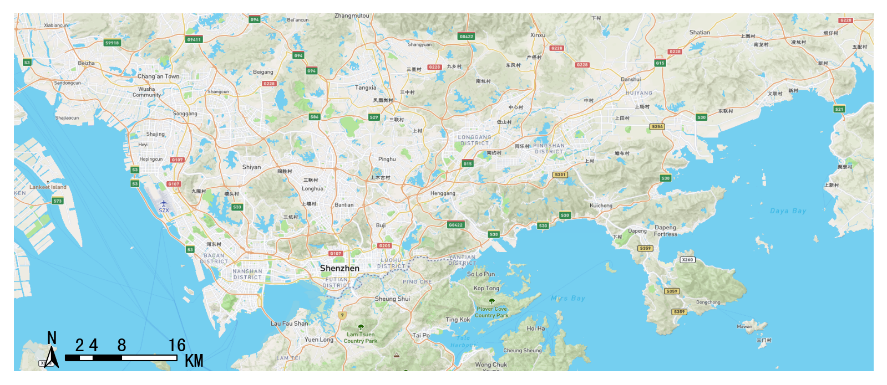
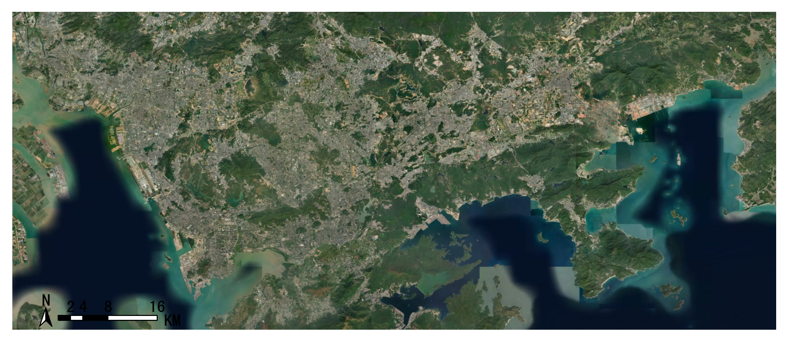
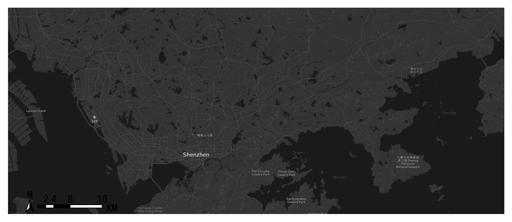
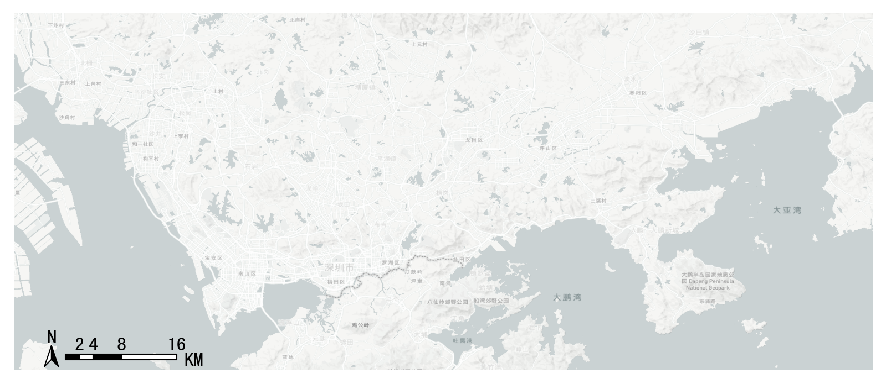
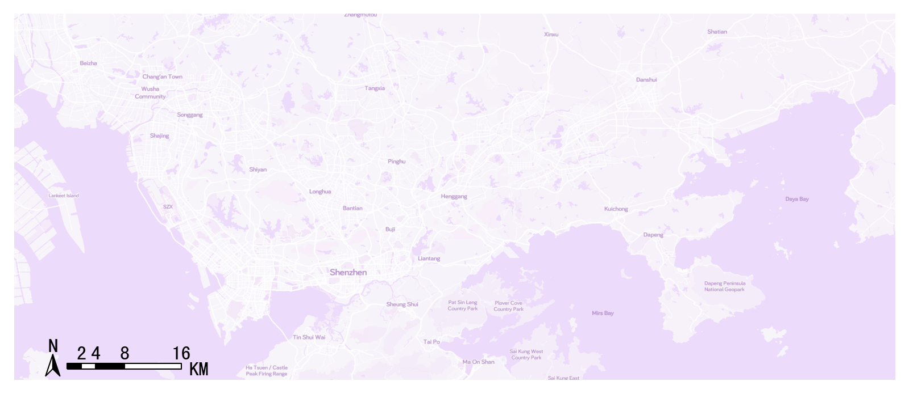
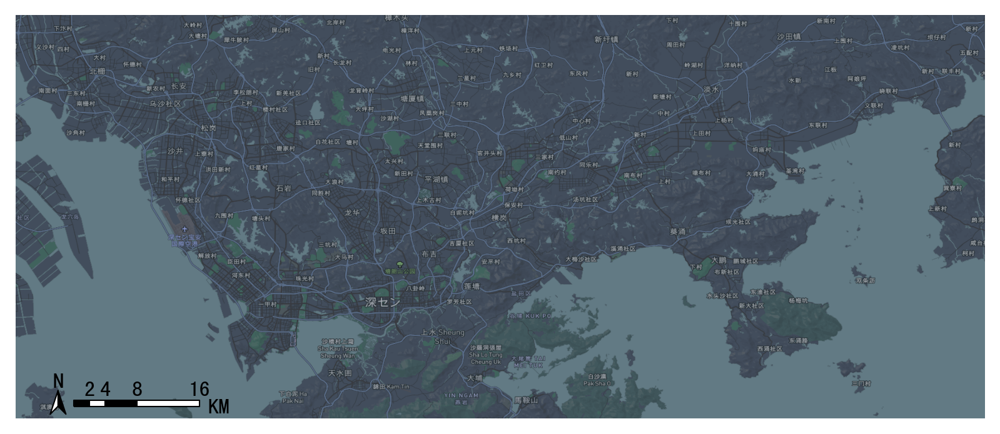
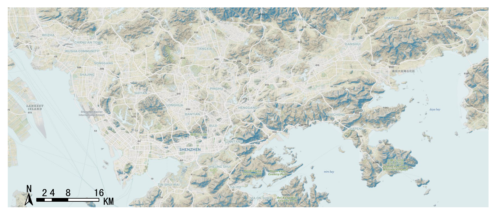
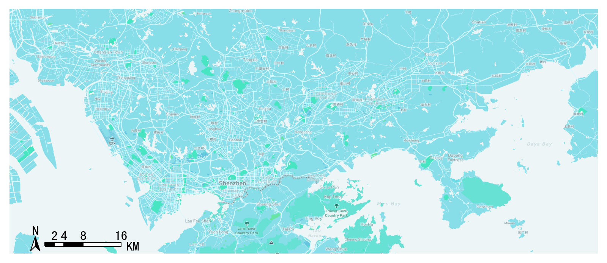

# plot_map

 

plot_map包提供了在matplotlib上绘制地图底图的功能. 目前，plot_map的功能已经并入[TransBigData](https://transbigdata.readthedocs.io/zh_CN/latest/)包中，你可以直接使用plot_map，也可以使用TransBigData(带有与plot_map相同的功能)

## 安装

### 用pypi安装 

plot_map包依赖于geopandas和matplotlib，如果你已经安装了这些依赖，则直接在命令提示符中运行下面代码即可安装：

    pip install -U plot-map

### 用conda-forge安装 

你也可以用conda-forge安装`plot_map`，这种方式会自动解决环境依赖，不过国内可能需要更换conda源。运行下面代码即可安装：

    conda install -c conda-forge plot_map

## 底图加载功能

### 底图配置

地图底图由mapbox提供，坐标系为WGS84。如果你要使用该功能，首先需要点击[这个链接](https://account.mapbox.com/auth/signin/?route-to=%22https://account.mapbox.com/%22)注册一个mapbox的账号，mapbox上注册成为开发者，并获取到一个mapbox token。 [这个链接](https://docs.mapbox.com/help/getting-started/access-tokens/#how-access-tokens-work)介绍了mapbox token的作用。

如果你已经得到了mapbox token，可以用以下代码为TransBigData设置mapbox token(只需要设置一次，后面重新打开python也不需要再重新设置了)：

    import transbigdata as tbd
    #用下面代码设置你的mapboxtoken
    tbd.set_mapboxtoken('pk.eyxxxxxxxxxx.xxxxxxxxx')#必须在里面设置你申请的token，直接复制此行代码无效！

另外还需要设置一个地图底图的存储位置，下一次显示同一个位置时，地图会从本地读取加载。

    #设置你的地图底图存储路径
    #如果你是linux或者mac系统，路径是这么写，注意最后有一个反斜杠
    tbd.set_imgsavepath(r'/Users/xxxx/xxxx/')
    #如果是windows系统，路径这么写，最后注意要两个斜杠以防转义
    tbd.set_imgsavepath(r'E:\pythonscript\xxx\\')

设置好后，下次绘制底图时，会在你设置的路径下创建一个tileimg文件夹，底图都放在里面  
尝试一下下面的代码，看看能否成功绘制底图

    #定义显示范围范围
    bounds = [113.6,22.4,114.8,22.9]
    #创建图框
    import matplotlib.pyplot as plt
    fig =plt.figure(1,(8,8),dpi=250)
    ax =plt.subplot(111)
    plt.sca(ax)
    #添加地图底图
    tbd.plot_map(plt,bounds,zoom = 11,style = 4)
    #添加比例尺和指北针
    tbd.plotscale(ax,bounds = bounds,textsize = 10,compasssize = 1,accuracy = 2000,rect = [0.06,0.03],zorder = 10)
    plt.axis('off')
    plt.xlim(bounds[0],bounds[2])
    plt.ylim(bounds[1],bounds[3])
    plt.show()

### 地图底图加载

plot_map.plot_map(plt,bounds,zoom='auto',style=4,printlog = False,styleid = 'dark')

添加地图底图

**输入**

bounds : List
    底图的绘图边界，[lon1,lat1,lon2,lat2] (WGS84坐标系) 其中，lon1,lat1是左下角坐标，lon2,lat2是右上角坐标 
zoom : number
    底图的放大等级，默认为auto自动选取。越大越精细，加载的时间也就越久，一般单个城市大小的范围，这个参数选取12到16之间 
printlog : bool
    是否显示日志                                                
style : number
    地图底图的样式，可选1-10，对应分别如下（需要plot_map包在0.3.3版本以上）   

底图样式1：streets
----------------------------------------

底图样式2：outdoors
----------------------------------------

底图样式3：satellite
----------------------------------------

底图样式4：light
----------------------------------------

底图样式5：dark
----------------------------------------

底图样式6：light-ch（中文）
----------------------------------------

底图样式7：ice creem
----------------------------------------

底图样式8：night
----------------------------------------

底图样式9：terrain
----------------------------------------

底图样式10：basic blue
----------------------------------------

用法
----------------------------------------

    #设定显示范围
    bounds = [lon1,lat1,lon2,lat2]  
    tbd.plot_map(plt,bounds,zoom = 12,style = 4)  

指北针和比例尺
=============================

plot_map.plotscale(ax,bounds,textcolor = 'k',textsize = 8,compasssize = 1,accuracy = 'auto',rect=[0.1,0.1],unit = "KM",style = 1,**kwargs)

为底图添加指北针和比例尺

**输入**

bounds : List
    底图的绘图边界，[lon1,lat1,lon2,lat2] (WGS84坐标系) 其中，lon1,lat1是左下角坐标，lon2,lat2是右上角坐标 
textsize : number
    标注文字大小                                                 
compasssize : number
    标注的指北针大小                                             
accuracy : number
    标注比例尺的长度（米）                                         
unit : str
    'KM','km','M','m' 比例尺的单位                               
style : number
    1或2，比例尺样式                                             
rect : List
    比例尺在图中的大致位置，如[0.9,0.9]则在右上角                    

使用方法：

    plot_map.plotscale(ax,bounds = bounds,textsize = 10,compasssize = 1,accuracy = 2000,rect = [0.06,0.03])  
